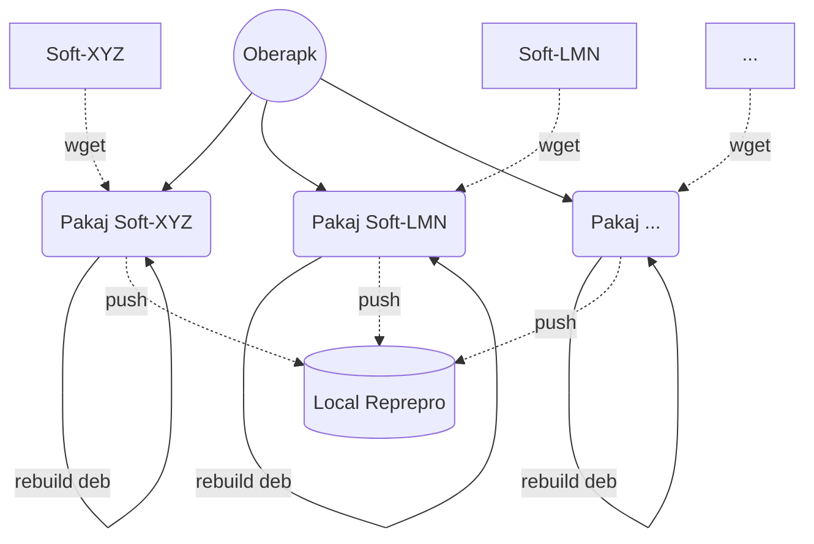

# Oberapk - Make/Build/Copy local Apt/Debian Package

For 36 reasons, you need to retrieve already working binary packages,
and you also need a local cache for all the computers in your fleet.
Oberapk is made to help you manage this task, here are some reasons.

* You have configured the computers in your fleet to fetch packages
  from your local apt repository.

* It is easier with your asset management tool to push software
  to a workstation if it is available in your repository.

* You need teams or zoom or any other software of this type,
  but you don't want the computers in your park to go
  and get them directly from the manufacturers.

* You develop user tools and system tools and you want
  to deploy them via your apt repository.

Oberapk allows you via a programmed task (cron) to update the packages
in `.deb` format locally on a computer,
then to push them into your apt repository via the reprepro tool.
Indeed, for the moment, Oberapk only works with the reprepro service.

Please note that Oberapk is not a tool for making packages.
It simply allows you to retrieve packages automatically
and push them to your local repository.

In order to distinguish a package from its recipe, in Oberapk,
the recipes are called `packaging`.
A set of recipes to apply will be called `kit`.



## Commands

```bash
oberapk help
oberapk avail
oberapk list
oberapk kit
oberapk update pkg
oberapk upgrade kit
```

* The `avail` command allows you to know all the available packaging
  in the Oberapk distribution.

* The `list` command allows you to know all the configure packaging
  defined  in your configuration file..

* The `kit` command lets you know the packaging set
  defined in your configuration file.

* The `update` command is used to start a recipe, and thus ultimately
  to update the packages that this packaging manages.

 * The `upgrade` command allows to apply all the packaging defined
   by a `kit`.
   If a kit `all` exists on your installation, then you can update
   with a single command the software of your local repository
   which are managed by Oberapk.

### Configuration file

There are two configuration files.
They can be under `/etc/oberapk` folder or under `$HOME/.local/oberapk`.

* `oberapk.conf` describes the local configuration of your site.
  It gives the available kits and packaging that can be applied
  and on which versions of the distribution.
  Each site pushes the packages it wants on the version(s) it wants.

  ```
  @all: @free @non-free
  @free: grv vscodium nodejs
  @non-free: discord teams teamviewer
  
  grv:4:        bullseye buster stretch
  vscodium:3:   bullseye buster
  nodejs:3:              buster stretch
  discord:2:             buster
  teams:2:      bullseye buster
  teamviewer:2: bullseye buster stretch
  ```

  For packaging, the second parameter is the number of old package
  to kept each time a new one is uploaded.
  If the new package is not functional,
  it is always possible to manually push one of the old versions
  to your local reprepo repository.

* `oberapk.sh` is a file in Bash format which defines
  the global variables.

  ```
  #CONF_FILE=/etc/oberapk/oberapk.conf
  #PAKAJ_FOLDER=/usr/share/oberapk/pakaj.d
  REPREPRO=/var/www/debian
  ```

### Usage

A simple usage is to upgrade all the packaging.
```bash
oberapk upgrade all
```

It's possible to just run just a packaging, for example `grv`.
```bash
oberapk update grv
```

If there is a problem in a kit, you can more easily tell which package
it is in by filtering the output a bit.
```bash
oberapk upgrade all 2>&1 | egrep -i '(error|info:)'
```

Upgrade quickly your own Oberapk version on your server
```bash
oberapk update oberapk; sudo apt update; sudo apt upgrade
```

A file `/etc/cron.d/oberapk` in the cron folder will update a set of
packages (`kit`). It's up to you to define it because there is no
predefined cron file and daily kit for the moment.
You also have to choose a user.
Be careful, Oberapk should never normally be run by the `root` user.
```
9:33 23 * * *  adm  test -x $(which oberapk) && oberapk upgrade all 2>&1 | logger -t oberap
```
