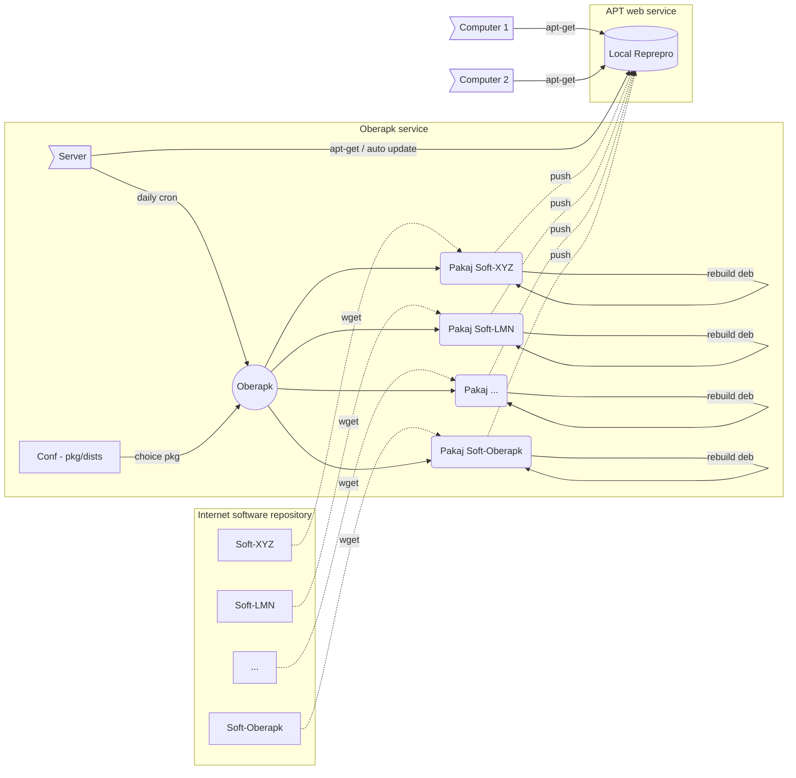

# Oberapk - Automated Debian packages download, modification and upload to a local Reprepro repository

Oberapk is a tool to automate the uploading of Debian packages
to a local [Reprepro](https://wiki.debian.org/DebianRepository/SetupWithReprepro) repository.
The goal is to simplify the provision of software on a local park
without having them fetch the packages on remote sites.
For each package, there is a specific recipe to get the latest version,
if any, and then push it to the right Debian distribution(s)
that your [Reprepro](https://wiki.debian.org/DebianRepository/SetupWithReprepro)
instance manages locally.

It is however possible to slightly modify the package during the recipe,
or to build very simple packages in which the programs are written
in scripting languages that do not need to be compiled
or complex build steps.
Oberapk is therefore not a copy or reimplementation of the mirroring protocol
built into [Reprepro](https://wiki.debian.org/DebianRepository/SetupWithReprepro).

A short [manual](https://legi.gricad-pages.univ-grenoble-alpes.fr/soft/trokata/oberapk/)
is available online, which is a copy of the command line manual.
However, most of the information is also listed below.

The master Git repository in on the [GRICAD Gitlab](https://gricad-gitlab.univ-grenoble-alpes.fr/legi/soft/trokata/oberapk).
Other Git repository are mirror or fork.

## Download / Ready-made package

Up-to-date Debian packages can be found at
https://legi.gricad-pages.univ-grenoble-alpes.fr/soft/trokata/oberapk/download/

Please note that the Debian packages are very simple
and certainly do not check all the Debian Policy rules and quality.
They are however functional and in production at LEGI.

## Description

For 36 reasons, you need to retrieve already working binary packages,
and you also need a local cache for all the computers in your fleet.
Oberapk is made to help you manage this task, here are some reasons.

* You have configured the computers in your fleet to fetch packages
  from your local apt repository.

* It is easier with your asset management tool to push software
  to a workstation if it is available in your repository.

* You need teams or zoom or any other software of this type,
  but you don't want the computers in your park to go
  and get them directly from the manufacturers.

* You develop user tools and system tools and you want
  to deploy them via your apt repository.

Oberapk allows you via a programmed task (cron) to update the packages
in `.deb` format locally on a computer,
then to push them into your apt repository via the reprepro tool.
Indeed, for the moment, Oberapk only works with the reprepro service.

Please note that Oberapk is not a tool for making packages
(unless they are really simple without compiling or downloading
any additional files).
It simply allows you to retrieve packages automatically
and push them to your local repository.

In order to distinguish a package from its recipe, in Oberapk,
the recipes are called `packaging`.
A set of recipes to apply will be called `kit`.

 | Breton | Français  | English   |
 |--------|-----------|-----------|
 | ober   | contruire | make      |
 | pakaj  | emballage | packaging |
 | stroll | ensemble  | kit       |

## Packaging list

This list is updated manually from time to time.
An always up to date list is to look at the files available
in the folder [pakaj.d](pakaj.d/)

[atom](https://github.com/atom/atom),
[backuppc-silzigan](https://gricad-gitlab.univ-grenoble-alpes.fr/legi/soft/trokata/backuppc-silizan),
[bidiez](https://gricad-gitlab.univ-grenoble-alpes.fr/legi/soft/trokata/bidiez),
[certcheck](https://gricad-gitlab.univ-grenoble-alpes.fr/legi/soft/trokata/certcheck),
[chrome](https://www.google.com/chrome/),
[ddt](https://gricad-gitlab.univ-grenoble-alpes.fr/legi/soft/trokata/ddt),
[discord](https://discord.com/),
[espanso](https://espanso.org),
[firefox-latest](https://www.mozilla.org/),
[freskein](https://gricad-gitlab.univ-grenoble-alpes.fr/legi/soft/trokata/freskein),
[f-secure](https://www.withsecure.com/en/support/product-support/business-suite/policy-manager) [f-secure-policy-manager-console f-secure-policy-manager-proxy f-secure-policy-manager-server],
[ganttproject](https://github.com/bardsoftware/ganttproject),
[gestex-ng](https://gricad-gitlab.univ-grenoble-alpes.fr/legi/soft/gestex),
[gestex](https://gricad-gitlab.univ-grenoble-alpes.fr/legi/soft/gestex),
[grv](https://github.com/rgburke/grv),
[icaclient](https://www.citrix.com/) [icaclient ctxusb],
[jitsi](https://desktop.jitsi.org/) [jitsi],
[kannad](https://gricad-gitlab.univ-grenoble-alpes.fr/legi/soft/trokata/kannad),
[klask](https://gricad-gitlab.univ-grenoble-alpes.fr/legi/soft/trokata/klask),
[libpng12](http://libpng.org/pub/png/libpng.html) [libpng12-1],
[masterpdf](https://code-industry.net/free-pdf-editor/),
[nagios-velvice](https://gricad-gitlab.univ-grenoble-alpes.fr/legi/soft/trokata/nagios-velvice),
[netdata](https://github.com/netdata/netdata),
[nodejs](https://stackoverflow.com/questions/48943416/bash-npm-command-not-found-in-debian-9-3),
[oberapk](https://gricad-gitlab.univ-grenoble-alpes.fr/legi/soft/trokata/oberapk),
[opensnitch](https://github.com/evilsocket/opensnitch/) [opensnitch python3-opensnitch-ui],
[powershell](https://microsoft.com/powershell),
[project-meta](https://gricad-gitlab.univ-grenoble-alpes.fr/legi/soft/trokata/project-meta),
[protonmail](https://proton.me) [protonmail-bridge],
[qgis](http://qgis.org/) [libqgis python-qgis python3-qgis qgis],
[quarto](https://github.com/quarto-dev/quarto-cli),
[rstudio](https://www.rstudio.com/),
[signal](https://signal.org/) [signal-desktop],
[singularity](https://docs.sylabs.io/guides/3.0/user-guide/installation.html) [singularity-container],
[skype](https://www.skype.com/) [skypeforlinux],
[spideroak](https://spideroak.com/) [spideroakone],
[tabby](https://tabby.sh/) [tabby-terminal],
[teams](https://teams.com/),
[teamviewer](https://www.teamviewer.com/),
[tixeoclient](https://www.tixeo.com/),
[tssh](https://gricad-gitlab.univ-grenoble-alpes.fr/legi/soft/trokata/tssh),
[virtualbox](https://www.virtualbox.org/wiki/Linux_Downloads),
[vscode](https://github.com/microsoft/vscode) [code code-insiders],
[vscodium](https://github.com/VSCodium/vscodium) [codium],
[yadedaily](https://yade-dem.org/) [yadedaily python3-yadedaily libyadedaily],
[yed](https://www.yworks.com/products/yed) [yed-latest],
[yq](https://github.com/mikefarah/yq),
[zoom](https://zoom.us/),
[zotero](https://www.zotero.org/).

## Schematic diagram of how it works



## Commands

```bash
oberapk help
oberapk avail
oberapk list
oberapk kit
oberapk update pkg
oberapk upgrade kit
```

* The `avail` command allows you to know all the available packaging
  in the Oberapk distribution.

* The `list` command allows you to know all the configure packaging
  defined  in your configuration file..

* The `kit` command lets you know the packaging set
  defined in your configuration file.

* The `update` command is used to start a recipe, and thus ultimately
  to update the packages that this packaging manages.

* The `upgrade` command allows to apply all the packaging defined
  by a `kit`.
  If a kit `all` exists on your installation, then you can update
  with a single command the software of your local repository
  which are managed by Oberapk.

* The `source` command is for developers. It allows to test a new recipe.
  It allows to set the global variables useful for the bash function. 

* The `binaries` command is for developers.
  It allows to list all the commands that have been used
  in the other recipes.
  It is preferable if possible to restrict yourself to these commands
  in order not to add any additional dependency to Oberapk. 

### Configuration file

There are two configuration files.
They can be under `/etc/oberapk` folder or under `$HOME/.local/oberapk`.

* `oberapk.conf` describes the local configuration of your site.
  It gives the available kits and packaging that can be applied
  and on which versions of the distribution.
  Each site pushes the packages it wants on the version(s) it wants.

  ```
  @all: @free @non-free
  @free: grv vscodium nodejs
  @non-free: discord teams teamviewer
  
  @daily: @free teams
  @weekly: teamviewer
  
  grv:4:        bullseye buster stretch
  vscodium:3:   bullseye buster
  nodejs:3:              buster stretch
  discord:2:             buster
  teams:2:      bullseye buster
  teamviewer:2: bullseye buster stretch
  ```

  For packaging, the second parameter is the number of old package
  to kept each time a new one is uploaded.
  If the new package is not functional,
  it is always possible to manually push one of the old versions
  to your local reprepo repository.

* `oberapk.sh` is a file in Bash format which defines
  the global variables.

  ```
  #CONF_FILE=/etc/oberapk/oberapk.conf
  #PAKAJ_FOLDER=/usr/share/oberapk/pakaj.d
  REPREPRO=/var/www/debian
  RUN_USER=lambda
  ```

### Usage

A simple usage is to upgrade all the packaging.
```bash
oberapk upgrade all
```

It's possible to just run just a packaging, for example `grv`.
```bash
oberapk update grv
```

If there is a problem in a kit, you can more easily tell which package
it is in by filtering the output a bit.
```bash
oberapk upgrade all 2>&1 | egrep -i '(error|info:)'
```

Upgrade quickly your own Oberapk version on your server
```bash
oberapk update oberapk; sudo apt update; sudo apt upgrade
```

### Cron job

One cron job is placed in the daily folder
and another in the weekly cron folder.
These tasks do not run as root, but switch to the `RUN_USER` account,
if and only if you have defined it.
These tasks run the daily and weekly kits,
so consider if you need to define `@daily` and `@weekly`
in your configuration file,
along with the associated software you want to update.

You can also define your own `/etc/cron.d/oberapk` file in the cron
folder which will update a set of packages (`kit`) you want,
at a time you want...
It is then up to you to define it because the predefined cron files
(daily and weekly...) are launched at a time fixed
by your system configuration.
Beware, Oberapk should never and refuses to be launched
by the user `root` (here `lambda`).
```
9:33 23 * * *  lambda  test -x $(which oberapk) && oberapk upgrade all 2>&1 | logger -t oberapk
```
It may not be a good idea to run it under the `www-data` account.
However, Apache (or Nginx) must have access to the folders
where Reprepro stores the packages that Oberapk pushes.

In case your repository is signed, which is better,
either you manually push the updates by doing an `oberapk upgrade all`
regularly in order to put the passphrase of the key,
or you have a key without passphrase as it is sometimes done
for SSH keys (which is dangerous),
or you have a GPG agent which keeps in RAM the passphrase
that you manually enter shortly after each reboot.

## Repository / Contribute

### Source

The whole code is under **free license**.
The script in ```bash``` is under GPL version 2 or more recent (http://www.gnu.org/licenses/gpl.html).
All the source code is available on the forge of the Grenoble campus:
https://gricad-gitlab.univ-grenoble-alpes.fr/legi/soft/trokata/oberapk
The sources are managed via Git (GitLab).
It is very easy to stay synchronized with these sources.

* The initial recovery
  ```bash
  git clone https://gricad-gitlab.univ-grenoble-alpes.fr/legi/soft/trokata/oberapk
  ```
* The updates afterwards
  ```bash
  git pull
  ```
* Contribute.
  It is possible to contribute by proposing pull requests,
  merge requests or simply old fashioned patches.

### Patch

It is possible to have a writing access to the project on the forge
on motivated request to [Gabriel Moreau](mailto:Gabriel.Moreau@univ-grenoble-alpes.fr).
For questions of administration time and security,
the project is not directly accessible in writing without authorization.
For questions of decentralization of the web, of autonomy
and non-allegiance to the ambient (and North American) centralism,
we use the forge of the university campus of Grenoble...

You can propose a patch by email of a particular file via the ```diff``` command:
```bash
diff -u oberapk.org oberapk.new > oberapk.patch
```
The patch is applied (after reading and rereading it) via the command:
```bash
patch -p0 < oberapk.patch
```

## COPYRIGHT

Copyright (C) 2017-2024, LEGI UMR 5519 / CNRS UGA G-INP, Grenoble, France

This project was originally written by
[Gabriel Moreau](mailto:Gabriel.Moreau@univ-grenoble-alpes.fr).

Licence: [GNU GPL version 2 or later](https://spdx.org/licenses/GPL-2.0-or-later.html)
